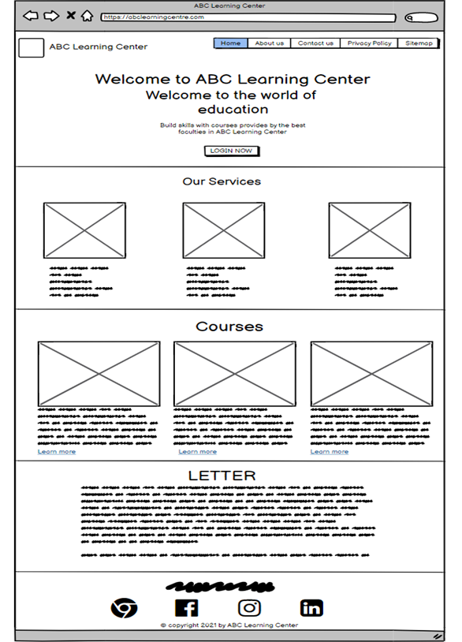

# ABC Learning Centre Website

## Project Description

The ABC Learning Centre Website is a comprehensive platform designed to provide information and services related to various courses offered by the center. This was my first academic project where I used HTML, CSS, and JavaScript to create a fully functional website. The project also incorporates form validations, form submissions, and utilizes Tailwind CSS at some level. Below is a detailed description of the website's structure and functionality.

### Features

- **Header:** The top section includes a logo of the ABC Learning Centre on the top-left and menu tabs for navigation.
- **Homepage:** Users can access the course schedule page and course details page directly from the homepage. The homepage also lists the services provided by the ABC Learning Centre and includes a motivational quote.
- **Footer:** Contains links to various social media pages of the ABC Learning Centre.
- **Form Validations:** Implemented for various forms on the website.
- **Wireframes:** Created using Balsamiq, a medium fidelity tool.
- **Storyboards:** Developed to illustrate the user experience.
- **Information Architecture (IA):** Designed to outline the structure of the website.

### Wireframes

Wireframes were created using Balsamiq, a tool used to sketch out user interfaces. It helps in visualizing the layout and functionality of the website before actual development.

 **Homepage:**
 

### Storyboards

Storyboards were created to depict the sequence of interactions a user might have with the website. They help in understanding the flow and ensuring a smooth user experience.

### Information Architecture

Information Architecture (IA) involves the organization of the website's content. It ensures that users can easily navigate and find the information they need.

### Pages Created

- Home Page
- Course Listing Page
- Course Details Page
- Course Schedule Page
- Contact Us Page
- Lead Registration Page
- Registration Thank You Page
- Sitemap Page
- Privacy Policy Page
- About Us Page

## Running the Project

### Way 1: Using Visual Studio Code with Live Server

1. Clone the project repository: https://github.com/PrachiDRaut1142/HuddleLandingPage2.git
2. Install the Live Server extension in Visual Studio Code.
3. Open the `index.html` file.
4. Right-click and select "Open With Live Server".

### Way 2: Using a Web Browser

1. Navigate to the project directory in your file explorer.
2. Right-click on `index.html`.
3. Choose your web browser from the "Open with" options.

### Hosting on Apache Webserver

Steps for hosting the website on Apache server:

1. Open the folder containing all HTML, CSS, and JavaScript files.
2. Copy the path of the folder.
3. Open the `httpd` file located at `C:\Program Files (x86)\Apache Software Foundation\Apache2.2\conf` in VS Code.
4. Add the following configurations:
   - Add your email or Gmail ID on line 161.
   - Add the document root and the desired URL for your website.
5. Click on "Retry as Administrator" and then "Yes" on the dialogue box that appears.
6. Open Command Prompt as administrator, navigate to the bin directory, and restart the system using the restart command.
7. Modify the `hosts` file located at `C:\Windows\System32\drivers\etc` to include the desired URL with the device's IP address.
8. Restart the system as instructed.
9. Open Chrome and enter the URL (e.g., www.ABC-Learning-Center.com) to view the hosted site.

## References

### Balsamiq

Balsamiq is a rapid wireframing tool that reproduces the experience of sketching on a whiteboard but using a computer. It helps in quickly creating and sharing wireframes to visualize the layout and functionality of the website.

### Storyboards

Storyboards are visual representations that illustrate the sequence of events or interactions a user might experience on a website or application. They are useful for planning and communicating design ideas effectively.

### Information Architecture (IA)

Information Architecture (IA) is the practice of structuring and organizing content on a website. It helps users find information efficiently and ensures a logical flow throughout the site.
